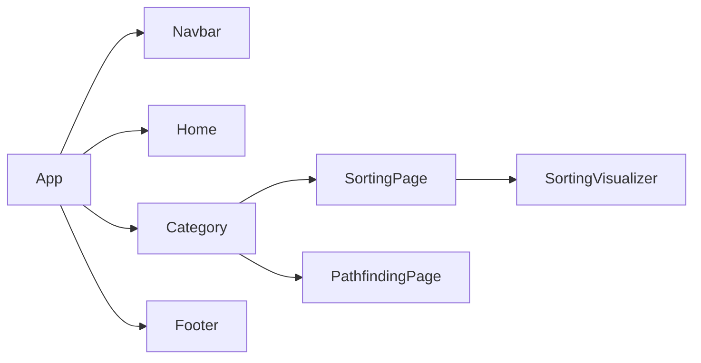

  
  

## [Algorithm Visualizer](https://algorithm-visuals.netlify.app/)

  

    
An algorithm visualizer created with React, Typescript, and GraphQL.

    <a href="https://algorithm-visuals.netlify.app/"><strong>Live Website - AlgoVisualizer</strong></a>
     
 React Web Application built on  
    <a href="https://reactjs.org/">React</a>
    ·
    <a href="https://www.typescriptlang.org/">TypeScript</a>
    ·
    <a href="https://tailwindcss.com/">TailwindCSS</a>
  

# About

Description            |  Screenshot
:---:|:----:
| 
- A simple React web application made to visualize algorithms   - Users will be able to choose from one of the sorting algorithms or pathfinding algorithms to explore and visualize.  
 |  |

(<a href="#top">back to top</a>)

# 

# Component Architecture

(<a href="#top">back to top</a>)

