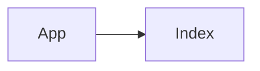

<div id="top" align="center">
  
  <a href="https://github.com/Kmachappy/Algo-Visualizer">
    
  </a>

  <a href="https://algorithm-visuals.netlify.app/">
    <h3 align="center">Algorithm Visualizer</h3>
  </a>

  <p align="center">
    <p>An algorithm visualizer created with React, Typescript, and GraphQL.</p>
    <a href="https://algorithm-visuals.netlify.app/"><strong>Live Website - AlgoVisualizer</strong></a>
    <br />
 React Web Application built on <br/>
    <a href="https://reactjs.org/">React</a>
    ·
    <a href="https://www.typescriptlang.org/">TypeScript</a>
    ·
    <a href="https://tailwindcss.com/">TailwindCSS</a>
  </p>
</div>

# About

Description            |  Screenshot
:---:|:----:
| <p align="left">- A simple React web application made to visualize algorithms <br> - Users will be able to choose from one of the sorting algorithms or pathfinding algorithms to explore and visualize. <br></p> |  |

<p align="right">(<a href="#top">back to top</a>)</p>


# Component Architecture



<p align="right">(<a href="#top">back to top</a>)</p>

---

# KmacShop WireFrame and ERD

Index/Home             |  Category/Filtered
:-------------------------:|:-------------------------:
  |  

Product Show             |   Current ERD
:-------------------------:|:-------------------------:
  |  

<p align="right">(<a href="#top">back to top</a>)</p>

---

# Routes

``` React
```


<p align="right">(<a href="#top">back to top</a>)</p>

---

# Schema

Schema/Models

``` test
```

<p align="right">(<a href="#top">back to top</a>)</p>

---

# Functionality

<p align="right">(<a href="#top">back to top</a>)</p>

---

# Current State

<p align="right">(<a href="#top">back to top</a>)</p>

---

# Roadmap and future Implementations

```test
```

<p align="right">(<a href="#top">back to top</a>)</p>

---

# User Story

<p align="right">(<a href="#top">back to top</a>)</p>

---

# Technologies used

- HTML
- CSS
- TailwindCSS
- JavaScript
- React
- TypeScript

<p align="right">(<a href="#top">back to top</a>)</p>

---

# API's used

<p align="right">(<a href="#top">back to top</a>)</p>

---

# AlgoVisualizer ScreenShots

Index/Home|Category/Filtered
:-------------------------:|:-------------------------:
  |  

Product Show             |   Cart Summary
:-------------------------:|:-------------------------:
  |  

User Profile           |  Checkout
:-------------------------:|:-------------------------:
  |  

<p align="right">(<a href="#top">back to top</a>)</p>

---

# Resources/Links

```test
```

<p align="right">(<a href="#top">back to top</a>)</p>
